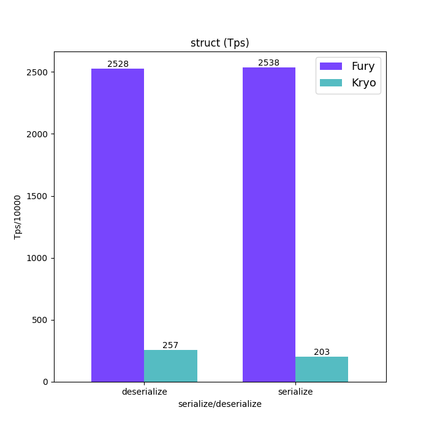
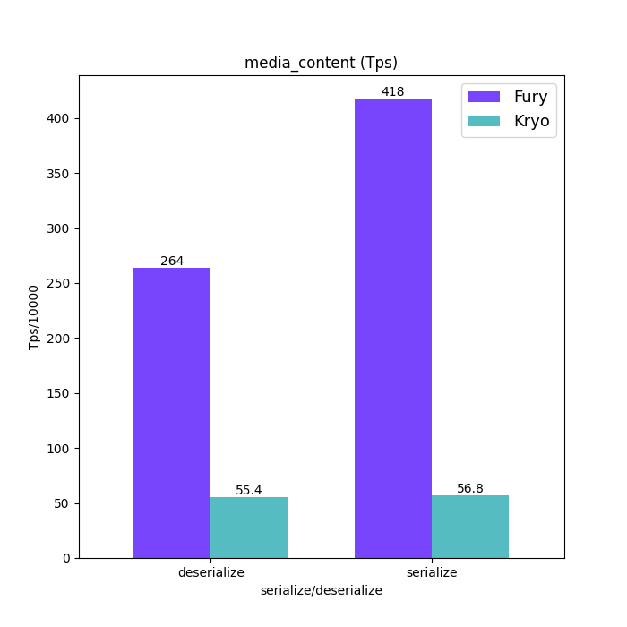
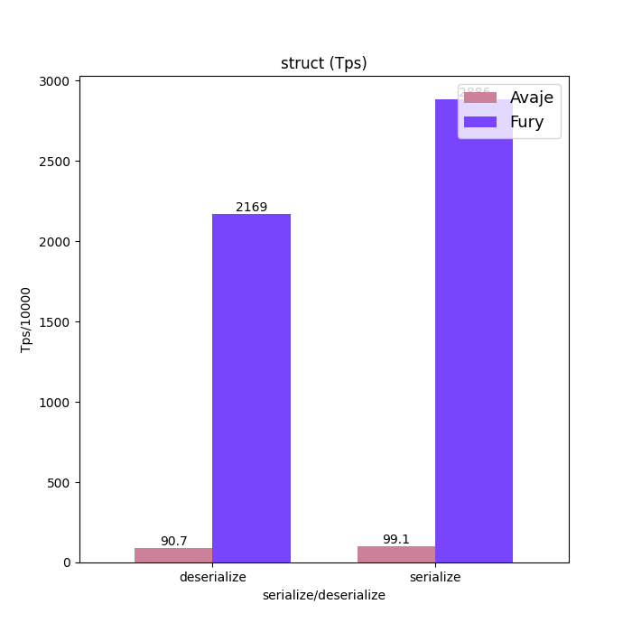
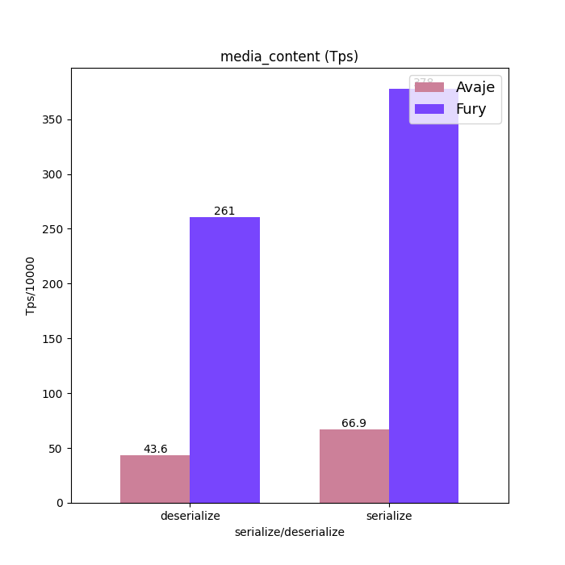

# Fury Benchmarks

Fury benchmarks with:
- [x] [jackson databind](https://github.com/FasterXML/jackson-databind)
- [x] [Microstream](https://github.com/real-logic/simple-binary-encoding)

# Benchmark Setup
JMH config:
`-f 3 -wi 5 -i 5 -t 1 -w 2s -r 2s -rf csv`
OS: macos monterey
Hardware: 2.6 GHz 6-Core Intel Core i7

# Benchmark Results
## Fury vs Jackson
Fury is 3x smaller for serialized binary size at most:
```java
furyMediaContentBytes size 336
furyStructBytes size 90
jacksonMediaContentBytes size 664
jacksonStructBytes size 278
```

The benchmark results here are for reference only. Jackson is a json format, fury is a binary format, which are suitable for different scenarios.
- Fury is 32.1x faster than jackson for Struct serialization
- Fury is 45x faster than jackson for Struct deserialization
- Fury is 8.8x faster than jackson for MediaContent serialization
- Fury is 11.8x faster than jackson for MediaContent deserialization

```java
Benchmark                                         Mode  Cnt         Score         Error  Units
JacksonBenchmark.furyDeserializeMediaContent     thrpt   15   2783918.470 ±   68075.351  ops/s
JacksonBenchmark.furyDeserializeStruct           thrpt   15  13686679.435 ± 1440816.885  ops/s
JacksonBenchmark.furySerializeMediaContent       thrpt   15   3410893.820 ±  265913.345  ops/s
JacksonBenchmark.furySerializeStruct             thrpt   15  17004519.876 ±  463107.804  ops/s
JacksonBenchmark.jacksonDeserializeMediaContent  thrpt   15    235938.122 ±   23054.241  ops/s
JacksonBenchmark.jacksonDeserializeStruct        thrpt   15    302600.964 ±   19586.158  ops/s
JacksonBenchmark.jacksonSerializeMediaContent    thrpt   15    386182.017 ±   38637.729  ops/s
JacksonBenchmark.jacksonSerializeStruct          thrpt   15    529044.347 ±   31945.826  ops/s
```
Compute speedup:
```python
import pandas as pd
df = pd.read_csv("jmh-result.csv")
s = df["Score"]
s[:4].to_numpy()/s[4:].to_numpy()
```
## Fury vs Microstream
Fury is 5x smaller for serialized binary size at most:
```java
furyMediaContentBytes size 336
furyStructBytes size 90
microstream mediaContentBytes size 1527
microstream structBytes size 120
```
Fury is :
```java
Benchmark                                                 Mode  Cnt         Score          Error  Units
MicrostreamBenchmark.furyDeserializeMediaContent         thrpt    3   2082751.515 ±  2638613.695  ops/s
MicrostreamBenchmark.furyDeserializeStruct               thrpt    3  10334292.992 ± 10542478.626  ops/s
MicrostreamBenchmark.furySerializeMediaContent           thrpt    3   2898943.216 ±   946978.784  ops/s
MicrostreamBenchmark.furySerializeStruct                 thrpt    3  13980885.316 ± 13424528.901  ops/s
MicrostreamBenchmark.microstreamDeserializeMediaContent  thrpt    3     76354.367 ±   231329.651  ops/s
MicrostreamBenchmark.microstreamSerializeMediaContent    thrpt    3     66316.198 ±   729572.587  ops/s
MicrostreamBenchmark.microstreamSerializeStruct          thrpt    3    233374.717 ±   732378.317  ops/s
```

## Fury vs Kryo in JDK17:
- Fury is 7.4x faster than jackson for MediaContent serialization
- Fury is 12.4x faster than jackson for Struct serialization
- Fury is 4.8x faster than kryo for Media deserialization
- Fury is 9.8x faster than jackson for Struct deserialization
```java
Benchmark                                   Mode  Cnt         Score         Error  Units
KryoBenchmark.furyDeserializeMediaContent  thrpt    9   2640092.499 ±  202407.109  ops/s
KryoBenchmark.furyDeserializeStruct        thrpt    9  25278785.961 ± 8825090.614  ops/s
KryoBenchmark.furySerializeMediaContent    thrpt    9   4178342.445 ±  231383.467  ops/s
KryoBenchmark.furySerializeStruct          thrpt    9  25381855.599 ± 1814377.686  ops/s
KryoBenchmark.kryoDeserializeMediaContent  thrpt    9    553602.089 ±   58868.923  ops/s
KryoBenchmark.kryoDeserializeStruct        thrpt    9   2570981.169 ±  150923.995  ops/s
KryoBenchmark.kryoSerializeMediaContent    thrpt    9    568136.453 ±   47477.469  ops/s
KryoBenchmark.kryoSerializeStruct          thrpt    9   2034529.376 ±  372048.444  ops/s
```
<p align="center">


</p>

## Fury vs Avaje
For serialized data size, fury is half of avaje:
```java
furyMediaContentBytes size 336
furyStructBytes size 70
avaje mediaContentBytes size 586
avaje structBytes size 149
```

```java
Benchmark                                     Mode  Cnt         Score         Error  Units
AvajeBenchmark.avajeDeserializeMediaContent  thrpt    3    435874.584 ±   54036.329  ops/s
AvajeBenchmark.avajeDeserializeStruct        thrpt    3    906966.403 ± 1349025.028  ops/s
AvajeBenchmark.avajeSerializeMediaContent    thrpt    3    669107.596 ±   11450.125  ops/s
AvajeBenchmark.avajeSerializeStruct          thrpt    3    990601.474 ±   61731.364  ops/s
AvajeBenchmark.furyDeserializeMediaContent   thrpt    3   2607302.095 ± 2653734.646  ops/s
AvajeBenchmark.furyDeserializeStruct         thrpt    3  21689653.040 ± 2702955.367  ops/s
AvajeBenchmark.furySerializeMediaContent     thrpt    3   3775725.625 ±  273398.873  ops/s
AvajeBenchmark.furySerializeStruct           thrpt    3  28858705.061 ± 4330421.563  ops/s
```
<p align="center">


</p>